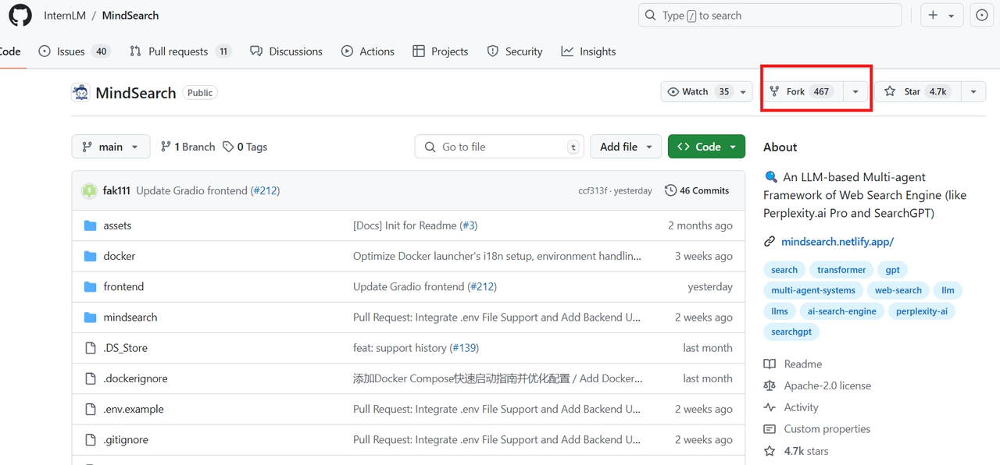

# MindSearch 介绍及原理
## 介绍
**Google 、百度 等 Web搜索引擎改变了过去寻找信息的方式，ChatGPT的爆火出圈为信息寻求答案添加了新范式。大语言模型 (Large Language Model，LLM) 蓬勃发展，许多模型在通过优化搜索引擎策略来解决信息寻求和集成任务上普遍遇到三个挑战：** <br>
**1. 在面对复杂请求时，搜索引擎难以一次性精确回复所需的全量网络信息；** <br>
**2. 要集成的相关信息散布在多个网页中，存在信息干扰；** <br>
**3. 大量的网络内容可能超过大语言模型可处理的上下文长度。** <br>
受人类解决这些问题时的认知过程的启发，MindSearch模拟人类在网络信息搜索和整合中的思维过程，通过一个简单而有效的基于LLM的多代理框架来实例化，该框架由WebPlanner（网络规划师）和WebSearcher组成。<br>
MindSearch的多代理设计使整个框架能够在3分钟内从更大规模（超过300个）网页中并行地寻找和整合信息，值得3小时的人力努力，可以用ChatGPT-4o或InternLM2.5-7B模型作为基座。MindSearch在Closed-Set  （封闭集）和 Open-Set （开放集）QA问题的深度、广度以及准确度（facticity）方面的响应质量都有显著提高。此外，基于InternLM2.5-7B的MindSearch的反应比ChatGPT-Web（GPT-4o）和Perplexity.ai 更可取，这意味着开源模型的 MindSearch已经可以为人工智能搜索引擎提供一个有竞争力的解决方案。<br>


## 2 WebPlanner and WebSearcher
MindSearch框架由一个WebPlanner和一组WebSearcher组成。

### 2.1 WebPlanner: Planning via Graph Construction   (通过图形构建进行规划)<br>
WebPlanner充当高级规划员，协调推理步骤和协调其他代理。
为了提高LLM处理复杂问题的能力，将解决问题的过程建模为一个有向无环图（DAG）。<br>
给定一个用户问题Q，解轨迹表示为G(Q)=V，E，其中V是一组节点V，每个节点代表一个独立的网络搜索，包括一个辅助启动节点（初始问题）和一个END节点（最终答案）。E表示有向边，表示节点（搜索内容）之间的推理拓扑关系（搜索内容）。这种DAG形式主义捕获了寻找最优执行路径的复杂性，为LLM提供了更正式和直观的表示。<br>
预定义了原子代码函数，以将节点或边添加到图中。<br>
在每个回合中，LLM首先读取整个对话，包括之前生成的代码和web搜索结果，然后输出思想和新代码用于思维导图的推理，这是由Python解释器执行的。在执行期间，一旦一个节点被添加到推理图中，它将调用一个WebSearcher来执行搜索过程并总结信息。<br>

图中通过一个具体的例子，说明WebPlanner如何通过规划作为编码一步一步地解决这个问题。在每个回合中，Web计划程序会输出一系列的想法和生成的代码。该代码将被执行，并将搜索结果提供给规划器。在最后一轮，Web规划程序直接提供最终响应，无需生成任何代码。<br>
由于新添加的节点只依赖于前面步骤中生成的节点，因此我们可以将它们并行化，以实现更快的信息聚合速度。收集所有信息后，计划器通过添加结束节点生成最终响应. <br>
通过与Python解释器的集成，WebPlanner通过统一的代码操作与图进行交互，动态地构建推理路径。这种“code as planning”的过程使LLM能够充分利用其优越的代码生成能力，在长上下文场景中有利于控制和数据流，并在解决复杂问题时获得更好的性能。<br>
### 2.2 WebSearcher: Web Browsing with Hierarchical Retrieval （使用层次检索的网页浏览）

WebSearcher作为一个复杂的 RAG (Retrieve-and-Generate)（检索和生成）代理，由query rewrite（查询重写）、search content aggregation（搜索内容聚合）、detailed page selection（详细的页面选择）、final summarization（最终的总结）四部分组成，具有互联网访问权限，根据搜索结果总结有价值的响应。<br>
WebSearcher采用了一种直接的从粗到细的选择策略。最初，LLM根据WebPlanner分配的问题生成几个类似的查询，以扩大搜索内容，从而提高相关信息的召回率。然后，这些查询通过各种搜索api执行，如谷歌、Bing和DuckDuckGo，它们返回关键内容，包括webURLs, titles, and summaries。搜索结果会根据weburl自动合并，并提示LLM选择最有价值的页面进行详细阅读。然后，将所选weburl的完整内容添加到LLM的输入中。在阅读了这些结果后，LLM会根据搜索结果生成一个响应来回答原始问题。这种层次检索方法大大降低了浏览大量网页的难度，并允许有效地提取具有深度细节的高度相关的信息。<br>
# MindSearch 架构及代码分析
### 1. 云端开发 &  MindSearch 分析<br>
考虑境外环境问题，我们选择github的codespaces,这样大家打开加速器后，开发push部署会方便些。<br>
CodeSpaces 相当于自己有了一个云主机，真正实现了云端开发，CodeSpaces 和 Github 做了很好的集成，可以很方便的针对 Github 项目做修改，而且可以根据自己的需要自定义服务器配置和环境，很多开源项目已经集成了 CodeSpaces 的支持，可以很方便的在线开发。<br>
#### 1.1 Fork  MindSearch  &  目录结构
项目地址：https://github.com/InternLM/MindSearch

创建 fork 完成后，打开[codespace](https://github.com/codespaces)主页，新建一个codespaces环境配置，点击右上角的New codespace。<br>
（由于直接使用模板快速开始，最终可能会出现Network Error）<br>

选择刚刚fork 的仓库，这时它会自动选择main主枝，Southeast Asia ，请务必将Southeast Asia换为**其他地区**，比如US West 、Europe West 否则可能会出现Network Error。

.png)
刚进去是背景是现代浅色，有些刺眼，这时可以，点击左下角的设置--主题--颜色主题--- 有三种深色，选一个即可，便和我们开发机里的vscode一样了，对眼睛友好。

##### 1.1.1 ：虚拟环境  
```python
# 创建环境
conda create -n mindsearch python=3.10 -y
# 激活环境
conda activate mindsearch
# 安装依赖 
lmdeploy==0.5.3
pip install -r /workspaces/MindSearch/requirements.txt
``` 
Ps: 初次运行 conda activate mindsearch 激活环境,可能出现CondaError，<br>
CondaError: Run 'conda init' before 'conda activate' <br>
退出重进，新建终端，出现（base）即可（亲测有效┗|｀O′|┛ 嗷~~）<br>
##### 1.1.2 目录结构
```python
cd /workspaces/MindSearch
# 项目三层结构
tree -L 3
```
```python
.
├── Dockerfile
├── LICENSE
├── README.md
├── README_zh-CN.md
├── assets
│   ├── logo.svg
│   ├── mindsearch_openset.png
│   └── teaser.gif
├── backend_example.py
├── docker       
│   ├── README.md
│   ├── README_zh-CN.md
│   ├── msdl
│   │   ├── __init__.py
│   │   ├── __main__.py
│   │   ├── config.py
│   │   ├── docker_manager.py
│   │   ├── i18n.py
│   │   ├── templates
│   │   ├── translations
│   │   └── utils.py
│   └── setup.py
├── frontend                                                                                                      ............................... 前端
│   ├── React
│   │   ├── README.md
│   │   ├── index.html
│   │   ├── package-lock.json
│   │   ├── package.json
│   │   ├── src
│   │   ├── tsconfig.json
│   │   ├── vite.config.ts
│   │   └── windows-.png
│   ├── css
│   │   └── gradio_front.css
│   ├── mindsearch_gradio.py
│   └── mindsearch_streamlit.py
├── mindsearch
│   ├── __pycache__
│   │   ├── app.cpython-310.pyc
│   │   └── app.cpython-312.pyc
│   ├── agent                                                                                  ...............................  代理
│   │   ├── __init__.py
│   │   ├── __pycache__
│   │   ├── mindsearch_agent.py
│   │   ├── mindsearch_prompt.py                                                                    .............  提示词
│   │   └── models.py
│   ├── app.py
│   └── terminal.py
└── requirements.txt
```
补充tree的部分常用命令
```python
tree -a 显示所有；
tree -d 只显示文档夹；
tree -L n 显示项目的层级，n表示层级数，比如想要显示项目三层结构，可以用tree -l 3；
tree -I pattern 用于过滤不想要显示的文档或者文档夹。比如你想要过滤项目中的 node_modules 文档夹，可以使用 tree -I “node_modules”；
tree > tree.md 将项目结构输出到 tree.md 这个文档
```
#### 1.2 多代理设计
由上文可知，MindSearch 整个框架核心在于多代理设计，故我们打开agent文件夹，一窥究竟。
##### 1.2.1 __init__.py
文件位于: /workspaces/MindSearch/mindsearch/agent/__init__.py
```python
import os
from datetime import datetime
##  从lagent.actions 引入 ActionExecutor, BingBrowser
from lagent.actions import ActionExecutor, BingBrowser

import mindsearch.agent.models as llm_factory
from mindsearch.agent.mindsearch_agent import (MindSearchAgent,
                                               MindSearchProtocol)
from mindsearch.agent.mindsearch_prompt import (
    FINAL_RESPONSE_CN, FINAL_RESPONSE_EN, GRAPH_PROMPT_CN, GRAPH_PROMPT_EN,
    fewshot_example_cn, fewshot_example_en, graph_fewshot_example_cn,
    graph_fewshot_example_en, searcher_context_template_cn,
    searcher_context_template_en, searcher_input_template_cn,
    searcher_input_template_en, searcher_system_prompt_cn,
    searcher_system_prompt_en)

LLM = {}
## 初始化默认代理    DuckDuckGoSearch
def init_agent(lang='cn', model_format='internlm_server',search_engine='DuckDuckGoSearch'):
    llm = LLM.get(model_format, None)
    if llm is None:
        llm_cfg = getattr(llm_factory, model_format)
        if llm_cfg is None:
            raise NotImplementedError
        llm_cfg = llm_cfg.copy()
        llm = llm_cfg.pop('type')(**llm_cfg)
        LLM[model_format] = llm

    interpreter_prompt = GRAPH_PROMPT_CN if lang == 'cn' else GRAPH_PROMPT_EN
    plugin_prompt = searcher_system_prompt_cn if lang == 'cn' else searcher_system_prompt_en
    if not model_format.lower().startswith('internlm'):
        interpreter_prompt += graph_fewshot_example_cn if lang == 'cn' else graph_fewshot_example_en
        plugin_prompt += fewshot_example_cn if lang == 'cn' else fewshot_example_en

    agent = MindSearchAgent(
        llm=llm,
        protocol=MindSearchProtocol(meta_prompt=datetime.now().strftime(
            'The current date is %Y-%m-%d.'),
                                    interpreter_prompt=interpreter_prompt,
                                    response_prompt=FINAL_RESPONSE_CN
                                    if lang == 'cn' else FINAL_RESPONSE_EN),
        searcher_cfg=dict(
            llm=llm,
            plugin_executor=ActionExecutor(
                ##   BingBrowser
                BingBrowser(searcher_type=search_engine,
                            topk=6,
                            api_key=os.environ.get('WEB_SEARCH_API_KEY',
                                                   'YOUR WEB SEARCH ENGINE API'))),
            protocol=MindSearchProtocol(
                meta_prompt=datetime.now().strftime(
                    'The current date is %Y-%m-%d.'),
                plugin_prompt=plugin_prompt,
            ),
            template=dict(input=searcher_input_template_cn
                          if lang == 'cn' else searcher_input_template_en,
                          context=searcher_context_template_cn
                          if lang == 'cn' else searcher_context_template_en)),
        max_turn=10)
    return agent
```
##### 1.2.2 尝试更改 Web 搜索
```python
cd /opt/conda/envs/mindsearch/lib/python3.10/site-packages/lagent/actions 
 tree -L 1
```
```python
.
├── __init__.py
├── __pycache__
├── action_executor.py
├── arxiv_search.py
├── base_action.py
├── bing_map.py
├── builtin_actions.py
├── google_scholar_search.py
├── google_search.py
├── ipython_interactive.py
├── ipython_interpreter.py
├── ipython_manager.py
├── parser.py
├── ppt.py
├── python_interpreter.py
└── web_browser.py

1 directory, 15 files
```
在 web_browser.py 文件中，定义了三个关键的类，它们分别是：
###### 1.2.2.1 class BingBrowser(BaseAction) 类
此类是被设计为 SearcherAgent 中的 Action 组件，负责处理搜索相关的核心逻辑。此类含有两个重要的函数，分别是 search() 和 select()。<br>
def search() 函数，当接收到 SearcherAgent 生成的多个 query（以列表形式表示）后，单独给每个在 queries 列表中的 query 开启一个线程，并且调用对应的 searcher.serach() 函数来执行相应的 搜索 API 调用。<br>
```python
## def search() 函数
@tool_api
def search(self, query: Union[str, List[str]]) -> dict:
    """BING search API
    Args:
        query (List[str]): list of search query strings
    """
    queries = query if isinstance(query, list) else [query]
    search_results = {}

    with ThreadPoolExecutor() as executor:
        future_to_query = {
            executor.submit(self.searcher.search, q): q
            for q in queries
        }
```
def select() 函数，在 SearcherAgent 接收到 search() 函数返回的搜索 API 结果后，它会判断哪些网站的内容需要进一步深入查询，并调用 select() 函数来处理这些需求。select()函数会为每个需要深入查询的网页（通过索引值标识）单独开启一个线程，并利用 ContentFetcher 类（即 fetcher）来抓取这些网站的详细内容。值得注意的是，所有的 searcher 都共享同一个 ContentFetcher 实例。
```python
## def select() 函数
@tool_api
def select(self, select_ids: List[int]) -> dict:
    """get the detailed content on the selected pages.

    Args:
        select_ids (List[int]): list of index to select. Max number of index to be selected is no more than 4.
    """
    if not self.search_results:
        raise ValueError('No search results to select from.')

    new_search_results = {}
    with ThreadPoolExecutor() as executor:
        future_to_id = {
            executor.submit(self.fetcher.fetch,
                            self.search_results[select_id]['url']):
            select_id
            for select_id in select_ids if select_id in self.search_results
        }
```
###### 1.2.2.2 class ContentFetcher 类
ContentFetcher 类中的 fetch 函数负责使用 Python 的 requests 模块从网站抓取内容，并通过 BeautifulSoup 库将获取的 HTML 文档结构化。(注意，需要 cookie 授权的网站会访问失败。)
```python
class ContentFetcher:
    @cached(cache=TTLCache(maxsize=100, ttl=600))
    def fetch(self, url: str) -> Tuple[bool, str]:
        try:
            response = requests.get(url, timeout=self.timeout)
            response.raise_for_status()
            html = response.content
        except requests.RequestException as e:
            return False, str(e)

        text = BeautifulSoup(html, 'html.parser').get_text()
        cleaned_text = re.sub(r'\n+', '\n', text)
        return True, cleaned_text
```
###### 1.2.2.3 class BaseSearch 类
这是实现新的 Searcher 类时需要继承的一个基类，其主要目的是调用内部的 _filter_results 函数。该函数的作用是确保从 searcher 返回的内容不包含黑名单中的 URL ，并且确保返回的内容数量不超过 topk。
```python
class BaseSearch:
    def _filter_results(self, results: List[tuple]) -> dict:
        filtered_results = {}
        count = 0
        for url, snippet, title in results:
            if all(domain not in url
                   for domain in self.black_list) and not url.endswith('.pdf'):
                filtered_results[count] = {
                    'url': url,
                    'summ': json.dumps(snippet, ensure_ascii=False)[1:-1],
                    'title': title
                }
                count += 1
                if count >= self.topk:
                    break
        return filtered_results
```
浏览 web_browser.py 结合 actions/ 目录结构可知，当前支持的 Web 搜索 包括：<br>
- ArxivSearch   不好用
- BingSearch
- GoogleSearch
- DuckDuckGoSearch
- BraveSearch
要使用不同类型的 Web 搜索 API，请修改如下位置    mindsearch/agent/__init__.py  中searcher_cfg  
searcher_type的属性 例如，要更改为 Brave Search API，您可以按如下方式对其进行配置：
```python
BingBrowser(
    searcher_type='BraveSearch',
    topk=2,
    api_key=os.environ.get('BRAVE_API_KEY', 'YOUR BRAVE API')
)
```
##### 1.2.3 class WebSearchGraph 类
位于：/workspaces/MindSearch/mindsearch/agent/mindsearch_agent.py<br>
WebSearchGraph 类，此类用于管理网络搜索图的节点和边，并通过网络代理进行搜索，旨实现一个网络搜索图
```python
##卜 WebSearchGraph 的类，旨实现一个网络搜索图
class WebSearchGraph:
    end_signal = 'end'
    searcher_cfg = dict()
## 初始化 `WebSearchGraph` 实例。
    def __init__(self):
        self.nodes = {}
        self.adjacency_list = defaultdict(list)
        self.executor = ThreadPoolExecutor(max_workers=10)
        self.future_to_query = dict()
        self.searcher_resp_queue = queue.Queue()
## **属性：**

## `nodes` (Dict[str, Dict[str, str]]): 存储图中所有节点的字典。每个节点由其名称索引，并包含内容、类型以及其他相关信息。
## `adjacency_list` (Dict[str, List[str]]): 存储图中所有节点之间连接关系的邻接表。每个节点由其名称索引，并包含一个相邻节点名称的列表。

## 方法：`add_root_node`
## 添加原始问题作为根节点。
    def add_root_node(self, node_content, node_name='root'):
        self.nodes[node_name] = dict(content=node_content, type='root')
        self.adjacency_list[node_name] = []
        self.searcher_resp_queue.put((node_name, self.nodes[node_name], []))
## **参数：**

## `node_content` (str): 用户提出的问题。
## `node_name` (str, 可选): 节点名称，默认为 'root'。

## 方法：`add_node`
## 添加搜索子问题节点并返回搜索结果。
    def add_node(self, node_name, node_content):
        self.nodes[node_name] = dict(content=node_content, type='searcher')
        self.adjacency_list[node_name] = []

        def model_stream_thread():
            agent = SearcherAgent(**self.searcher_cfg)
            try:
                parent_nodes = []
                for start_node, adj in self.adjacency_list.items():
                    for neighbor in adj:
                        if node_name == neighbor[
                                'name'] and start_node in self.nodes and 'response' in self.nodes[
                                    start_node]:
                            parent_nodes.append(self.nodes[start_node])
                parent_response = [
                    dict(question=node['content'], answer=node['response'])
                    for node in parent_nodes
                ]
                for answer in agent.stream_chat(
                        node_content,
                        self.nodes['root']['content'],
                        parent_response=parent_response):
                    self.searcher_resp_queue.put(
                        deepcopy((node_name,
                                  dict(response=answer.response,
                                       detail=answer), [])))
                self.nodes[node_name]['response'] = answer.response
                self.nodes[node_name]['detail'] = answer
            except Exception as e:
                logger.exception(f'Error in model_stream_thread: {e}')

        self.future_to_query[self.executor.submit(
            model_stream_thread)] = f'{node_name}-{node_content}'
## **参数：

## `node_name` (str): 节点名称。
## `node_content` (str): 子问题内容。

## **返回：**

## `str`: 返回搜索结果。

## 方法：`add_response_node`

## 当前获取的信息已经满足问题需求，添加回复节点。
    def add_response_node(self, node_name='response'):
        self.nodes[node_name] = dict(type='end')
        self.searcher_resp_queue.put((node_name, self.nodes[node_name], []))
## **参数：**

## `node_name` (str, 可选): 节点名称，默认为 'response'。

## 方法：`add_edge`

## 添加边。

    def add_edge(self, start_node, end_node):
        self.adjacency_list[start_node].append(
            dict(id=str(uuid.uuid4()), name=end_node, state=2))
        self.searcher_resp_queue.put((start_node, self.nodes[start_node],
                                      self.adjacency_list[start_node]))
## **参数：**

## `start_node` (str): 起始节点名称。
## `end_node` (str): 结束节点名称。

## 方法：`reset`

## 重置节点和边。
    def reset(self):
        self.nodes = {}
        self.adjacency_list = defaultdict(list)
## 方法：`node`

## 获取节点信息。

    def node(self, node_name):
        return self.nodes[node_name].copy()
## **参数：**

## `node_name` (str): 节点名称。

## **返回：**

## `str`: 返回包含节点信息的字典，包含节点的内容、类型、思考过程（如果有）和前驱节点列表。
```
最后，我们打开models.py 模型配置文件<br>
位于：/workspaces/MindSearch/mindsearch/agent/mindsearch_prompt.py
```python
import os
.......
internlm_hf = dict(type=HFTransformerCasualLM,
                   path='internlm/internlm2_5-7b-chat',
                   meta_template=INTERNLM2_META,
                   top_p=0.8,
                   top_k=None,
                   temperature=1e-6,
                   max_new_tokens=8192,
                   repetition_penalty=1.02,
                   stop_words=['<|im_end|>'])
# openai_api_base needs to fill in the complete chat api address, such as: https://api.openai.com/v1/chat/completions
gpt4 = dict(type=GPTAPI,
            model_type=os.environ.get('OPENAI_MODEL', 'gpt-4o'),
            key=os.environ.get('OPENAI_API_KEY', 'YOUR OPENAI API KEY'),
            openai_api_base=os.environ.get('OPENAI_API_BASE', 'https://api.openai.com/v1/chat/completions'),
            )

url = 'https://dashscope.aliyuncs.com/api/v1/services/aigc/text-generation/generation'
qwen = dict(type=GPTAPI,
            model_type='qwen-max-longcontext',
            key=os.environ.get('QWEN_API_KEY', 'YOUR QWEN API KEY'),
            openai_api_base=url,
            meta_template=[
                dict(role='system', api_role='system'),
                dict(role='user', api_role='user'),
                dict(role='assistant', api_role='assistant'),
                dict(role='environment', api_role='system')
            ],
            top_p=0.8,
            top_k=1,
            temperature=0,
            max_new_tokens=4096,
            repetition_penalty=1.02,
            stop_words=['<|im_end|>'])

internlm_silicon = dict(type=GPTAPI,
                        model_type=os.environ.get('SILICON_MODEL', 'internlm/internlm2_5-7b-chat'),
                        key=os.environ.get('SILICON_API_KEY', 'YOUR SILICON API KEY'),
                        openai_api_base='https://api.siliconflow.cn/v1/chat/completions',
                        meta_template=[
                            dict(role='system', api_role='system'),
                            dict(role='user', api_role='user'),
                            dict(role='assistant', api_role='assistant'),
                            dict(role='environment', api_role='system')
                        ],
                        top_p=0.8,
                        top_k=1,
                        temperature=0,
                        max_new_tokens=8192,
                        repetition_penalty=1.02,
                        stop_words=['<|im_end|>'])
```
我们可以看到有internlm_server和internlm_client 本地服务器和客户端  internlm_hf Hugging Face远程端 
gpt4  qwen  internlm_silicon  模型相关配置<br>
至此，我们对MindSearch有了一定的了解。接下来，让我们开始MindSearch 实践之旅。
# MindSearch 实践之旅
由介绍和models.py知，MindSearch可以用ChatGPT-4o或InternLM2.5-7B等模型作为基座，想要开展MindSearch实践，模型API_KEY是必不可少的。Siliconflow硅基流动提供了一些模型免费的api ,接下来，我们注册账户并获取API_KEY。https://siliconflow.cn/zh-cn/models

#### 1.3 SILICON_API_KEY 获取
https://account.siliconflow.cn/login
https://cloud.siliconflow.cn/account/ak

**回到 codespace 中。**
##### 1.3.1 配置环境变量API_KEY
```python
export SILICON_API_KEY=上步中复制的api_key密钥
conda activate mindsearch
pip install class_registry
cd /workspaces/MindSearch/
python -m mindsearch.app --lang cn --model_format internlm_silicon --search_engine DuckDuckGoSearch
```
命令解释
```Markdown
--lang：模型的语言，适用于英语和中文。en cn
--model_format：模型的格式。  
internlm_silicon 用于 InternLM2.5-7b-chat 与远程服务器。（InternLM2.5-7b-chat 已针对中文进行了更好的优化。）
gpt4对于 GPT4。 
--search_engine：搜索引擎。
DuckDuckGoSearch用于 DuckDuckGo 的搜索引擎。
BingSearch用于 Bing 搜索引擎。
BraveSearch对于 Brave 搜索 Web API 引擎。
GoogleSearch用于 Google Serper 网络搜索 api 引擎。
请将您的 Web 搜索引擎 API 密钥设置为环境变量，除非您使用的是 .WEB_SEARCH_API_KEY  DuckDuckGo
```
Ps: 若出现 ModuleNotFoundError: No module named 'griffe.enumerations'<br>
 终端运行 ：pip install griffe==0.48<br>
 若出现ImportError: cannot import name 'AutoRegister' from 'class_registry' (/opt/conda/envs/mindsearch/lib/python3.10/site-packages/class_registry/__init__.py) #202<br>
终端运行 ：pip install class_registry<br>
参考：https://github.com/InternLM/MindSearch/issues/202

##### 1.3.2  前端启动
由于codespace自动进行端口转发，我们便不需要打开打开powerShell 做端口映射。点击“ + ” 号，新建终端。
```python
conda activate mindsearch
cd /workspaces/MindSearch/
```
- Gradio
```python
python frontend/mindsearch_gradio.py
```


可以清晰地看到 MindSearch 高级规划员 WebPlanner 推理步骤 与 WebSearcher 搜索结果。
## MindSearch 部署  
分为 **Space 空间**  **令牌**  **推送** 三部分
#### 1.4 部署到 HuggingFace Space
##### 1.4.1 创建Space 空间 
https://huggingface.co/spaces ，并点击 Create new Space，如下图所示。

在输入 Space name 并选择 License 后，其它配置如下所示。

选择公开方便大家可以看到。接下来，我们进入 Settings，配置硅基流动的 api_key。<br>
往下滑，选择 New secrets，name 一栏输入 SILICON_API_KEY，value 一栏输入你的API_KEY的内容。<br>

##### 1.4.2 创建一个有写权限的token,点击右上角的头像，点击设置，找到Access Tokens ,新建token。


##### 1.4.3 新建目录 & 推送代码
新空间已创建，请按照以下步骤开始。新建一个目录，创建 gradio app.py 文件，然后 commit 并推送（或者，您可以直接在浏览器中创建 app.py 文件。）<br>
回到 codespace 中，由于将整个Mindsearch的推送会有很多问题（git submodule无法提交代码，space中项目启动失败等）。我们选择新建一个目录
```python
conda activate mindsearch
# 创建新目录
mkdir -p /workspaces/MindSearch/mindsearch_deploy
# 准备复制文件
cd /workspaces/MindSearch/
cp -r /workspaces/MindSearch/mindsearch /workspaces/MindSearch/mindsearch_deploy
cp /workspaces/MindSearch/requirements.txt /workspaces/MindSearch/mindsearch_deploy
cp -r /workspaces/MindSearch/frontend/css /workspaces/MindSearch/mindsearch_deploy
touch  /workspaces/MindSearch/mindsearch_deploy/app.py
# 将原先 frontend/mindsearch_gradio.py 文件里的内容粘贴到新建的app.py
cp /workspaces/MindSearch/frontend/mindsearch_gradio.py /workspaces/MindSearch/mindsearch_deploy/app.py
```
由于huggingface space 无法切换终端，分别启动前后端。我们需要启动命令代码合到一个app.py。<br>
在mindsearch_deploy/app.py添加：
```python
os.system("python -m mindsearch.app --lang cn --model_format internlm_silicon &")
```
更改端口号
```python
demo.launch(server_name='0.0.0.0',
            server_port=7860,
            inbrowser=True,
            share=True)
```
###### 最终app.py 内容如下  可直接复制粘贴。
```python
import json
import os
os.system("python -m mindsearch.app --lang cn --model_format internlm_silicon &")
import gradio as gr
import requests
from lagent.schema import AgentStatusCode

PLANNER_HISTORY = []
SEARCHER_HISTORY = []

def rst_mem(history_planner: list, history_searcher: list):
    '''
    Reset the chatbot memory.
    '''
    history_planner = []
    history_searcher = []
    if PLANNER_HISTORY:
        PLANNER_HISTORY.clear()
    return history_planner, history_searcher

def format_response(gr_history, agent_return):
    if agent_return['state'] in [
            AgentStatusCode.STREAM_ING, AgentStatusCode.ANSWER_ING
    ]:
        gr_history[-1][1] = agent_return['response']
    elif agent_return['state'] == AgentStatusCode.PLUGIN_START:
        thought = gr_history[-1][1].split('```')[0]
        if agent_return['response'].startswith('```'):
            gr_history[-1][1] = thought + '\n' + agent_return['response']
    elif agent_return['state'] == AgentStatusCode.PLUGIN_END:
        thought = gr_history[-1][1].split('```')[0]
        if isinstance(agent_return['response'], dict):
            gr_history[-1][
                1] = thought + '\n' + f'```json\n{json.dumps(agent_return["response"], ensure_ascii=False, indent=4)}\n```'  # noqa: E501
    elif agent_return['state'] == AgentStatusCode.PLUGIN_RETURN:
        assert agent_return['inner_steps'][-1]['role'] == 'environment'
        item = agent_return['inner_steps'][-1]
        gr_history.append([
            None,
            f"```json\n{json.dumps(item['content'], ensure_ascii=False, indent=4)}\n```"
        ])
        gr_history.append([None, ''])
    return

def predict(history_planner, history_searcher):

    def streaming(raw_response):
        for chunk in raw_response.iter_lines(chunk_size=8192,
                                             decode_unicode=False,
                                             delimiter=b'\n'):
            if chunk:
                decoded = chunk.decode('utf-8')
                if decoded == '\r':
                    continue
                if decoded[:6] == 'data: ':
                    decoded = decoded[6:]
                elif decoded.startswith(': ping - '):
                    continue
                response = json.loads(decoded)
                yield (response['response'], response['current_node'])

    global PLANNER_HISTORY
    PLANNER_HISTORY.append(dict(role='user', content=history_planner[-1][0]))
    new_search_turn = True

    url = 'http://localhost:8002/solve'
    headers = {'Content-Type': 'application/json'}
    data = {'inputs': PLANNER_HISTORY}
    raw_response = requests.post(url,
                                 headers=headers,
                                 data=json.dumps(data),
                                 timeout=20,
                                 stream=True)

    for resp in streaming(raw_response):
        agent_return, node_name = resp
        if node_name:
            if node_name in ['root', 'response']:
                continue
            agent_return = agent_return['nodes'][node_name]['detail']
            if new_search_turn:
                history_searcher.append([agent_return['content'], ''])
                new_search_turn = False
            format_response(history_searcher, agent_return)
            if agent_return['state'] == AgentStatusCode.END:
                new_search_turn = True
            yield history_planner, history_searcher
        else:
            new_search_turn = True
            format_response(history_planner, agent_return)
            if agent_return['state'] == AgentStatusCode.END:
                PLANNER_HISTORY = agent_return['inner_steps']
            yield history_planner, history_searcher
    return history_planner, history_searcher

examples = [
    ['Find legal precedents in contract law.'],
    ['What are the top 10 e-commerce websites?'],
    ['Generate a report on global climate change.'],
]
import os
css_path = os.path.join(os.path.dirname(__file__), 'css', 'gradio_front.css')
with gr.Blocks(css=css_path) as demo:
    with gr.Column(elem_classes='chat-box'):
        gr.HTML("""<h1 align="center">MindSearch Gradio Demo</h1>""")
        gr.HTML(
            """<p style="text-align: center; font-family: Arial, sans-serif;">
                MindSearch is an open-source AI Search Engine Framework with Perplexity.ai Pro performance.
                You can deploy your own Perplexity.ai-style search engine using either
                closed-source LLMs (GPT, Claude)
                or open-source LLMs (InternLM2.5-7b-chat).</p> """)
        gr.HTML("""
        <div style="text-align: center; font-size: 16px;">
        <a href="https://github.com/InternLM/MindSearch" style="margin-right: 15px;
         text-decoration: none; color: #4A90E2;" target="_blank">🔗 GitHub</a>
        <a href="https://arxiv.org/abs/2407.20183" style="margin-right: 15px;
         text-decoration: none; color: #4A90E2;" target="_blank">📄 Arxiv</a>
        <a href="https://huggingface.co/papers/2407.20183" style="margin-right:
         15px; text-decoration: none; color: #4A90E2;" target="_blank">📚 Hugging Face Papers</a>
        <a href="https://huggingface.co/spaces/internlm/MindSearch"
         style="text-decoration: none; color: #4A90E2;" target="_blank">🤗 Hugging Face Demo</a>
        </div>""")
    gr.HTML("""
       <h1 align='right'></h1> """)

    with gr.Row():
        with gr.Column(scale=10):
            with gr.Row():
                with gr.Column():
                    planner = gr.Chatbot(label='planner',
                                         show_label=True,
                                         show_copy_button=True,
                                         bubble_full_width=False,
                                         render_markdown=True,
                                         elem_classes='chatbot-container')
                with gr.Column():
                    searcher = gr.Chatbot(label='searcher',
                                          show_label=True,
                                          show_copy_button=True,
                                          bubble_full_width=False,
                                          render_markdown=True,
                                          elem_classes='chatbot-container')

            with gr.Row(elem_classes='chat-box'):
                # Text input area
                user_input = gr.Textbox(show_label=False,
                                        placeholder='Type your message...',
                                        lines=1,
                                        container=False,
                                        elem_classes='editor')
                # Buttons (now in the same Row)
                submitBtn = gr.Button('submit',
                                      variant='primary',
                                      elem_classes='toolbarButton')
                clearBtn = gr.Button('clear',
                                     variant='secondary',
                                     elem_classes='toolbarButton')
            with gr.Row(elem_classes='examples-container'):
                examples_component = gr.Examples(examples,
                                                 inputs=user_input,
                                                 label='Try these examples:')

    def user(query, history):
        return '', history + [[query, '']]

    def submit_example(example):
        return user(example[0], planner.value)

    submitBtn.click(user, [user_input, planner], [user_input, planner],
                    queue=False).then(predict, [planner, searcher],
                                      [planner, searcher])
    clearBtn.click(rst_mem, [planner, searcher], [planner, searcher],
                   queue=False)

demo.queue()
demo.launch(server_name='0.0.0.0',
            server_port=7860,
            inbrowser=True,
            share=True)

```
从huggingface把空的代码仓库clone到codespace。需要先新建一个目录/workspaces/codespaces-blank
```python
mkdir -p /workspaces/codespaces-blank
cd /workspaces/codespaces-blank

# 把token挂到仓库上，让自己有写权限
git clone https://<你的名字>:<私人令牌>@huggingface.co/spaces/<你的名字>/<仓库名称>
# cd <仓库名称>
cd <仓库名称>
cp -r /workspaces/MindSearch/mindsearch_deploy/* .
. 一定不能少
```

选择codespaces-blank  看一下仓库里的文件全不全。  （patriotism是我的仓库名）<br>
最终如下：

```python
git add .
git commit -m "update"
git push
```

#### 1.5 部署gitee.ai
考虑到上传huggingface有一定的困难，部署到国内gitee.ai上，也是一个不错的选择。<br>
 https://ai.gitee.com/  （整体操作和HuggingFace Space类似）

##### 1.5.1 进入工作台后，点击应用，新建应用。

在输入 应用名称  并选择 许可证 后，其它配置如下所示。

同样需要添加app.py入口文件<br>
点击设置，选择功能，新建密钥，键： SILICON_API_KEY，值：硅基流动的 api_key。

##### 1.5.2 私人令牌
进入gitee -- 个人设置 -- 私人令牌 。

复制令牌<br>
从gitee.ai把空的代码仓库clone到codespace。
```python
cd /workspaces/codespaces-blank
# 把token挂到仓库上，让自己有写权限
git clone https://<你的名字>:<私人令牌>@ai.gitee.com/<你的名字>/<仓库名称>

cd <仓库名称>
cp -r /workspaces/MindSearch/mindsearch_deploy/* .
```
##### 1.5.3 推送代码
```python
git add .
git commit -m "update"
git push
```

#### 部署到 Modelers
天翼云与华为联合打造的魔乐（Modelers）开发者社区正式上线发布。 通过建设社区，双方将携手使能 AI 应用创新，共促国产 AI 生态繁荣   https://modelers.cn/
##### 1.6.1  创建空间 
选择和前两个差不多，在这里可以上传自选封面图。https://modelers.cn/spaces/new

这是一个基于CPU的gradio类型体验空间，我们需要至少上传app.py和requirements.txt两个文件。当文件内容符合gradio和python编程规范后，空间会自动触发镜像构建，并运行gradio服务。找到设置，创建机密变量。

##### 1.6.2 创建一个有write权限的令牌。

##### 1.6.3 推送代码
```python
cd /workspaces/codespaces-blank
# 把token挂到仓库上，让自己有写权限
git clone https://<你的名字>:<私人令牌>@modelers.cn/<你的名字>/<仓库名称>
cd <仓库名称>
cp -r /workspaces/MindSearch/mindsearch_deploy/* .
https://modelers.cn/spaces/Mucunshuo/opulent
```
```python
git add .
git commit -m "space init"
git branch -M main
git push -u origin main
```
# MindSearch相关
- 论文 https://arxiv.org/pdf/2407.20183
- 代码 https://github.com/InternLM/MindSearch/
- 应用 https://mindsearch.openxlab.org.cn/
- Web https://mindsearch.netlify.app/

**鸣谢以下文章作者和MindSearch兴趣小组以及张富才大佬的建议及赵老师的指导。** <br>

参考文章：
- https://github.com/InternLM/MindSearch/issues/202
- https://freeaihunter.com/cn
- Cursor使用硅基流动API打造免费代码小助手
- 如何在MindSearch中集成新的搜索API，全面提升智能搜索能力！
