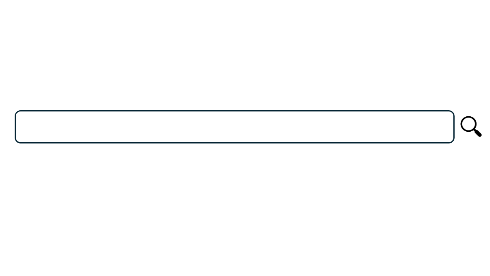
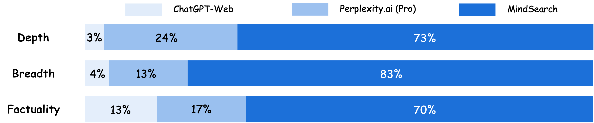

<div id="top"></div>

<div align="center">

<br>
[Research Preview](https://mindsearch.netlify.app/) | [Paper]() | [Blog](https://mindsearch.netlify.app/mindsearch)
</div>

<div align="center">

[](https://lagent.readthedocs.io/en/latest/)
[](https://pypi.org/project/lagent)
[](https://github.com/InternLM/lagent/tree/main/LICENSE)

<!-- English | [简体中文](README_zh-CN.md) -->

</div>

<p align="center">
    👋 join us on <a href="https://twitter.com/intern_lm" target="_blank">𝕏 (Twitter)</a>, <a href="https://discord.gg/xa29JuW87d" target="_blank">Discord</a> and <a href="https://r.vansin.top/?r=internwx" target="_blank">WeChat</a>
</p>



## ✨ MindSearch: Mimicking Human Minds is the Secret of Deep AI Searcher

MindSearch is an open-source AI Search Engine Framework with Perplexity.ai Pro performance. You can simply deploy it with your own perplexity.ai style search engine with either close-source LLMs (GPT, Claude) or open-source LLMs (InternLM2.5-7b-chat). It owns following features:
- 🤔 **Ask everything you want to know**: MindSearch is designed to solve any question in your life and use web knowledge.
- 📚 **In-depth Knowledge Discovery**: MindSearch browses hundreds of web pages to answer your question, providing deeper and wider knowledge base answer.
- 🔍 **Detailed Solution Path**: MindSearch exposes all details, allowing users to check everything they want. This greatly improves the credibility of its final response as well as usability.
- 💻 **Optimized UI Experimence**: Providing all kinds of interfaces for users, including React, Gradio, Streamlit and Terminal. Choose any type based on your need.

<div align="center">
https://github.com/user-attachments/assets/c2619971-3822-4ed4-a5ee-fdec0ec9c1b0
</div>

## ⚡️ MindSearch vs other AI Search Engines

Comparison on human preference based on depth, breadth, factuality of the response generated by ChatGPT-Web, Perplexity.ai (Pro), and MindSearch. Results are obtained on 100 human-crafted real-world questions and evaluated by 5 human experts*. 
<div align="center">

</div>
* All experiments are done before July.7 2024.

## ⚽️ Getting Started

### Lagent Installation

MindSearch backend with Lagent, please see the [overview](docs/en/get_started/overview.md) for the general introduction of Lagent. Meanwhile, we provide extremely simple code for quick start. You may refer to [examples](examples/) for more details.

### MindSearch

#### React Interface

We support standard front-backend web application for MindSearch. The detailed process please refer to .

#### Terminal Interface

```
python examples/
```

#### Gradio Interface

```
python examples/
```

#### Streamlit Interface

```
streamlit run examples/
```

## Citation

If you find this project useful in your research, please consider cite:

```latex
@misc{lagent2023,
    title={{Lagent: InternLM} a lightweight open-source framework that allows users to efficiently build large language model(LLM)-based agents},
    author={Lagent Developer Team},
    howpublished = {\url{https://github.com/InternLM/lagent}},
    year={2023}
}
```

## License

This project is released under the [Apache 2.0 license](LICENSE).