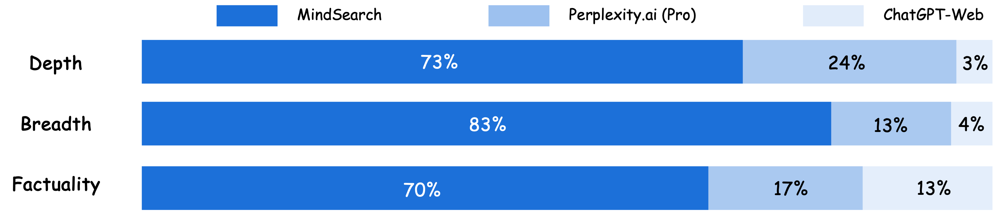

<div id="top"></div>

<div align="center">


[🌐 プロジェクトページ](https://mindsearch.netlify.app/) | [📃 論文](https://arxiv.org/abs/2407.20183) | [💻 プレイグラウンド](https://mindsearch.openxlab.org.cn/)

[English](README.md) | [简体中文](README_zh-CN.md) | 日本語

<https://github.com/user-attachments/assets/b4312e9c-5b40-43e5-8c69-929c373e4965>

</div>
</p>

## ✨ MindSearch: Mimicking Human Minds Elicits Deep AI Searcher

MindSearchは、Perplexity.ai Proと同等の性能を持つオープンソースのAI検索エンジンフレームワークです。クローズドソースのLLM（GPT、Claude）やオープンソースのLLM（InternLM2.5-7b-chat）を使用して、独自の検索エンジンを簡単にデプロイできます。以下の特徴を持っています：

- 🤔 **知りたいことを何でも質問**：MindSearchは、生活の中で遭遇するあらゆる質問に対してウェブ知識を使用して解決します。
- 📚 **深い知識の発見**：MindSearchは、数百のウェブページを閲覧して質問に答え、より深く広い知識ベースの回答を提供します。
- 🔍 **詳細な解決策のパス**：MindSearchはすべての詳細を公開し、ユーザーが知りたいことをすべて確認できるようにします。これにより、最終的な回答の信頼性と実用性が大幅に向上します。
- 💻 **最適化されたUI体験**：React、Gradio、Streamlit、ターミナルなど、ユーザー向けのさまざまなインターフェースを提供します。ニーズに応じて任意のタイプを選択できます。
- 🧠 **動的なグラフ構築プロセス**：MindSearchは、ユーザーのクエリをグラフ内の原子的なサブクエリとして分解し、WebSearcherの検索結果に基づいてグラフを段階的に拡張します。

<div align="center">


</div>

## ⚡️ MindSearch vs 他のAI検索エンジン

ChatGPT-Web、Perplexity.ai（Pro）、およびMindSearchが生成する応答の深さ、広さ、事実性に基づく人間の好みの比較。結果は、100の人間が作成した現実の質問に基づいており、5人の人間の専門家によって評価されています\*。

<div align="center">

</div>
* すべての実験は2024年7月7日以前に行われました。

## ⚽️ 独自のMindSearchを構築する

### ステップ1: 依存関係のインストール

```bash
pip install -r requirements.txt
```

### ステップ2: MindSearch APIのセットアップ

FastAPIサーバーをセットアップします。

```bash
python -m mindsearch.app --lang en --model_format internlm_server
```

- `--lang`: モデルの言語、`en`は英語、`zh`は中国語。
- `--model_format`: モデルの形式。
  - `internlm_server`は、ローカルサーバーでのInternLM2.5-7b-chat。
  - `gpt4`はGPT4。
    他のモデルを使用したい場合は、[models](./mindsearch/agent/models.py)を変更してください。

### ステップ3: MindSearchフロントエンドのセットアップ

以下のフロントエンドインターフェースを提供します。

- React

```bash
# Node.jsとnpmをインストール
# Ubuntuの場合
sudo apt install nodejs npm

# Windowsの場合
# https://nodejs.org/zh-cn/download/prebuilt-installerからダウンロード

# 依存関係をインストール

cd frontend/React
npm install
npm start
```

詳細は[React](./frontend/React/README.md)をご覧ください。

- Gradio

```bash
python frontend/mindsearch_gradio.py
```

- Streamlit

```bash
streamlit run frontend/mindsearch_streamlit.py
```

## 🐞 ローカルでデバッグ

```bash
python -m mindsearch.terminal
```

## 📝 ライセンス

このプロジェクトは[Apache 2.0ライセンス](LICENSE)の下でリリースされています。

## 引用

このプロジェクトが研究に役立つ場合は、以下の方法で引用してください：

```
@misc{chen2024mindsearchmimickinghumanminds,
      title={MindSearch: Mimicking Human Minds Elicits Deep AI Searcher},
      author={Zehui Chen and Kuikun Liu and Qiuchen Wang and Jiangning Liu and Wenwei Zhang and Kai Chen and Feng Zhao},
      year={2024},
      eprint={2407.20183},
      archivePrefix={arXiv},
      primaryClass={cs.CL},
      url={https://arxiv.org/abs/2407.20183},
}
```
