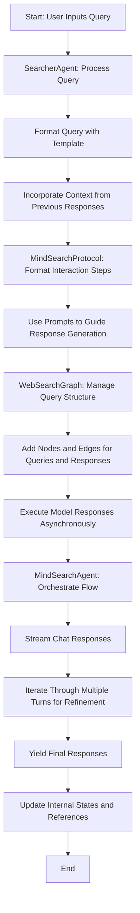

# MindSearchAgent Overview

The `MindSearchAgent` is a sophisticated agent designed to manage search processes using a language model. It leverages a combination of classes and protocols to handle search queries, format responses, and execute code commands. This document provides an overview of its components and flow.

## Components

### 1. SearcherAgent

- **Purpose**: A specialized agent for handling search queries.
- **Key Methods**:
  - `__init__`: Initializes the agent with a query template.
  - `stream_chat`: Streams chat responses for a given question, formatting the query and handling parent responses for context.

### 2. MindSearchProtocol

- **Purpose**: Manages the interaction with the MindSearch system, formatting protocol steps for execution.
- **Key Methods**:
  - `__init__`: Initializes the protocol with various prompts and configurations.
  - `format`: Formats the protocol steps for execution, incorporating meta, plugin, and interpreter prompts.

### 3. WebSearchGraph

- **Purpose**: Represents a graph structure for managing web search queries.
- **Key Methods**:
  - `__init__`: Initializes the graph with default settings.
  - `add_root_node`, `add_node`, `add_response_node`, `add_edge`: Methods to manipulate the graph structure.
  - `reset`: Resets the graph to its initial state.
  - `node`: Retrieves a copy of a node's data.

### 4. MindSearchAgent

- **Purpose**: Manages the search process using a language model.
- **Key Methods**:
  - `__init__`: Initializes the agent with a language model, searcher configuration, and protocol.
  - `stream_chat`: Streams chat responses for a given message, managing the interaction flow and handling multiple turns.

## Flow

1. **Initialization**:
   - The `MindSearchAgent` is initialized with a language model, searcher configuration, and protocol.
   - The `WebSearchGraph` is configured with the searcher settings.

2. **Handling Queries**:
   - The `SearcherAgent` processes search queries using the `stream_chat` method.
   - Queries are formatted using a template, and context from previous responses is incorporated if available.

3. **Protocol Execution**:
   - The `MindSearchProtocol` formats the steps for execution, using various prompts to guide the interaction.
   - The protocol manages the flow of information between the agent and the language model.

4. **Graph Management**:
   - The `WebSearchGraph` manages the structure of search queries, adding nodes and edges as needed.
   - It handles the execution of model responses in a threaded environment, ensuring asynchronous processing.

5. **Response Generation**:
   - The `MindSearchAgent` streams chat responses, iterating through multiple turns to refine the output.
   - It uses the protocol to format and execute code commands, generating references and managing the flow of information.

6. **Finalization**:
   - The agent yields the final responses, incorporating any generated references and updating the internal state.

## Conclusion

The `MindSearchAgent` is a powerful tool for managing search processes, utilizing a combination of agents, protocols, and graph structures to handle complex queries and generate meaningful responses. Its design allows for flexible interaction with language models, making it suitable for a wide range of applications.

## Diagram Overview

The `MindSearchAgent` workflow can be visualized as follows:

- **Start**: 
  - User inputs a query.
  
- **SearcherAgent**:
  - Receives the query.
  - Formats the query using a template.
  - Incorporates context from previous responses.

- **MindSearchProtocol**:
  - Formats the interaction steps.
  - Uses prompts to guide the response generation.

- **WebSearchGraph**:
  - Manages the structure of the query.
  - Adds nodes and edges for each query and response.
  - Executes model responses asynchronously.

- **MindSearchAgent**:
  - Orchestrates the flow.
  - Streams chat responses.
  - Iterates through multiple turns to refine responses.

- **End**:
  - Yields final responses.
  - Updates internal states and references.

This diagram illustrates the interactions between the components and the flow of data throughout the system.

