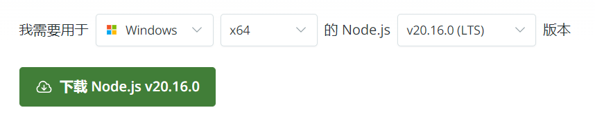

# Notice
问题回答过程中离开页面后再回到页面，会导致sse重连！
# 开始
## 请使用大于18.0.0的node版本
## 准备node.js开发环境
Node.js 是一个基于 Chrome V8 引擎的 JavaScript 运行环境，允许你在服务器端运行 JavaScript。以下是在 Windows、Linux 和 macOS 上安装 Node.js 的详细步骤。

### 在 Windows 上安装 Node.js
- 步骤 1: 访问 Node.js 官网

打开浏览器，访问 [Node.js](https://nodejs.org/zh-cn/download/prebuilt-installer) 官方网站。

- 步骤 2: 下载 Node.js 安装包

选择你需要的nodejs版本，设备的类型，点击下载，示例如下图：


- 步骤 3: 安装 Node.js

双击下载的安装包开始安装。

跟随安装向导的指示进行安装。在安装过程中，你可以选择安装位置、是否将 Node.js 添加到系统 PATH 环境变量等选项。推荐选择“添加到 PATH”以便在任何地方都能通过命令行访问 Node.js。
安装完成后，点击“Finish”结束安装。

- 步骤 4: 验证安装

打开命令提示符（CMD）或 PowerShell。
输入 node -v 并回车，如果系统返回了 Node.js 的版本号，说明安装成功。
接着，输入 npm -v 并回车，npm 是 Node.js 的包管理器，如果返回了版本号，表示 npm 也已正确安装。

### 在 Linux 上安装 Node.js
注意： 由于 Linux 发行版众多，以下以 Ubuntu 为例说明，其他发行版（如 CentOS、Debian 等）的安装方式可能略有不同，可自行查询对应的安装办法。

- 步骤 1: 更新你的包管理器

打开终端。

输入 sudo apt update 并回车，以更新 Ubuntu 的包索引。

- 步骤 2: 安装 Node.js

对于 Ubuntu 18.04 及更高版本，Node.js 可以直接从 Ubuntu 的仓库中安装。
输入 sudo apt install nodejs npm 并回车。
对于旧版本的 Ubuntu 或需要安装特定版本的 Node.js，你可能需要使用如 NodeSource 这样的第三方仓库。

- 步骤 3: 验证安装

在终端中，输入 node -v 和 npm -v 来验证 Node.js 和 npm 是否已正确安装。

### 在 macOS 上安装 Node.js

#### 下载安装
- 步骤 1: 访问 Node.js 官网

打开浏览器，访问 Node.js 官方网站。

- 步骤 2: 下载 Node.js 安装包

在首页找到 macOS 对应的安装包（通常是 .pkg 文件），点击下载。

- 步骤 3: 安装 Node.js

找到下载的 .pkg 文件，双击打开。
跟随安装向导的指示进行安装。
安装完成后，点击“Close”结束安装。

- 步骤 4: 验证安装

打开终端。

输入 node -v 和 npm -v 来验证 Node.js 和 npm 是否已正确安装。

#### 使用HomeBrew安装
前提条件：确保你的macOS上已经安装了Homebrew。如果尚未安装，可以通过以下命令进行安装（以终端操作为例）：
```
  /bin/bash -c "$(curl -fsSL https://raw.githubusercontent.com/Homebrew/install/HEAD/install.sh)"
```
按照提示输入密码以确认安装。安装过程中，可能需要你同意许可协议等。

- 打开终端：
在macOS上找到并打开“终端”应用程序。

- 使用Homebrew安装Node.js：
在终端中输入以下命令来安装最新版本的Node.js
```
  brew install node
```
Homebrew会自动下载Node.js的安装包，并处理相关的依赖项和安装过程。你需要等待一段时间，直到安装完成。

- 验证安装：
安装完成后，你可以通过输入以下命令来验证Node.js是否成功安装：
```
  node -v
```
如果终端输出了Node.js的版本号，那么表示安装成功。同时，你也可以通过输入npm -v来验证npm（Node.js的包管理器）是否也成功安装。

完成以上步骤后，你应该能在你的 Windows、Linux 或 macOS 系统上成功安装并运行 Node.js。

### 更多
如需了解更多，可参照：https://nodejs.org/en

如环境已经准备好，跳转下一步

## 安装依赖
进入前端项目根目录
```
  npm install
```

## 启动
```
  npm start
```

启动成功后，界面将出现可访问的本地url

## 配置
### 接口请求配置
- 如您需要配置的服务支持跨域，可至/src/config/cgi.ts中修改请求链接，请求链接为http://ip:port/path;
- 如您需要配置的服务不支持跨域，可至vite.config.ts中配置proxy，示例如下：

  ```
    server: {
      port: 8080,
      proxy: {
        "/solve": {
          target: "https://example.com",
          changeOrigin: true,
        }
      }
    }
  ```

## 知悉
- 前端服务基于react开发，如需了解react相关知识，可参考：https://react.dev/
